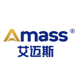
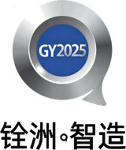

<div align="center">
  
  <h1>河北工业大学 RoboMaster 山海机甲战队</h1>
  <p><strong>保持热爱，共赴山海</strong></p>

  <p>
    <a href="https://space.bilibili.com/2055273988"></a>
    <a href="https://github.com/HebutMas"></a>
    
  </p>
</div>

---

## 📖 关于我们

河北工业大学 **RoboMaster 山海机甲战队** 是河北工业大学学生创新团队之一，由各专业热爱机器人技术的学生组建而成。战队成立于 2022 年，主要参加 **全国大学生机器人大赛 RoboMaster 机甲大师赛** 等赛事。

建队以来获得省国级奖项十余项，培养出了多名青年工程师和行业技术人才。

## 🌐 项目简介

本项目为山海机甲战队的**官方网站**，用于展示战队信息、成员介绍、开源项目、比赛赛程和战队图集等。网站采用纯静态前端技术构建，部署于 GitHub Pages。

### 🔗 在线访问

👉 [https://hebutmas.github.io/](https://hebutmas.github.io/)

## 🏗️ 技术栈

| 类别 | 技术 |
|------|------|
| 前端框架 | 原生 HTML5 / CSS3 / JavaScript（无构建步骤、无运行时依赖） |
| 样式 | 单文件 `style.css`，基于 CSS 自定义属性（design tokens） |
| 字体 | Noto Sans SC（正文）+ Barlow Condensed（数字与拉丁文展示），异步加载、系统字体兜底 |
| 图标 | 内联 SVG（不使用 emoji 作图标） |
| 部署 | GitHub Pages |

## 📁 项目结构

```
HebutMas.github.io/
├── index.html          # 首页 — Hero、数据、关于、团队架构、战绩、机器人、伙伴、联系
├── members.html        # 战队成员 — 现任队员 & 往届队员，JS 动态渲染 + 详情弹窗
├── open_source.html    # 项目开源 — RoboMaster 论坛帖 + GitHub 仓库，支持搜索过滤
├── photos.html         # 战队图集 — 网格画廊 + 灯箱浏览
├── schedule.html       # 赛季征程 — 时间线 + 荣誉墙
├── contact.html        # 联系我们 — 联系方式、留言表单
├── group.html          # 组别详情 — 由 ?id= 参数决定内容
├── robot.html          # 机器人详情 — 由 ?id= 参数决定内容
├── ghost.html          # 彩蛋页（Konami 秘籍 / 连点页脚 ❤ 进入）
├── style.css           # 全站样式（设计变量 + 组件 + 响应式）
├── html/               # 旧路径跳转页（保留兼容，noindex）
├── js/
│   ├── script.js       # 全局脚本：导航、滚动动效、背景视频控制、彩蛋
│   ├── members.js      # 成员数据 & 动态渲染
│   ├── open_source.js  # GitHub 仓库 & 论坛数据动态加载
│   ├── photos.js       # 图集数据 & 灯箱
│   ├── group.js        # 组别详情渲染
│   ├── robot.js        # 机器人详情渲染
│   └── ghost.js        # 彩蛋页脚本
├── source/             # 静态资源
│   ├── logo/  banner/  icons/  photos/  partners/  robots/
└── .agents/skills/     # 开发用 AI Agent 技能（不参与站点构建，见下）
```

## 📄 页面功能

| 页面 | 功能描述 |
|------|----------|
| **首页** | 视频背景 Hero、建队数据、团队介绍、三大模块导航、赛季战绩、机器人阵容、合作伙伴 |
| **战队成员** | 现任队员与往届队员展示，JS 动态渲染成员卡片，点击查看详情 |
| **项目开源** | RoboMaster 论坛开源帖 + GitHub 仓库列表，支持按名称/描述搜索 |
| **战队图集** | 图片网格布局，点击查看大图灯箱（支持 Esc 关闭） |
| **赛季征程** | 2022 年至今的赛季时间线 + 分赛事荣誉墙 |
| **联系我们** | 地址、邮箱、社交媒体 + 留言表单 |
| **组别 / 机器人详情** | 通过 URL 查询参数（`?id=`）切换内容 |

## 🎨 设计与可访问性规范

改样式前请先读 `style.css` 顶部的 `:root` 变量，不要在组件里写死颜色和尺寸。

- **配色**：取自队徽 —— 深海蓝 `#253F70` → 山岚蓝 `#319FD3`，深色基底 `#0a0b0d`。文字色全部满足 WCAG AA（正文 ≥ 4.5:1）。
- **字体**：`--font-body` 负责中文正文，`--font-display`（Barlow Condensed）负责数字与拉丁文展示，`--font-mono` 仅用于技术标签。
- **间距与圆角**：区块间距用 `--section-y`，圆角用 `--radius-xs/sm/md/pill`，保持「子元素圆角 ≤ 父元素」。
- **无障碍基线**：每页都有跳转主内容链接（`.skip-link`）、统一 `:focus-visible` 焦点环、`prefers-reduced-motion` 下关闭动效、图片带 `width`/`height` 防布局偏移、可点击元素使用语义标签（`<button>` / `<a>`）。
- **动效**：全站只在 Hero 做一处开场编排（`heroIn` 关键帧，纯 CSS 实现，`prefers-reduced-motion` 下自动失效），不做「每张卡片滚动浮现」的堆叠效果。**不要在 JS 里写内联 `style="transform: ..."`** —— 内联样式会压掉 CSS 里的 `:hover` 效果。

## 🤖 Agent Skills（开发辅助）

`.agents/skills/` 存放供 AI 编程助手（Claude Code、DeepSeek Harness 等）使用的技能包，用于统一本项目的设计质量与界面规范。**这些文件不参与网站构建，访问站点时不会被加载。**

内含 `frontend-design`、`theme-factory`、`ui-ux-pro-max`、`web-interface-guidelines` 四个技能，来源与用法见 [`.agents/skills/README.md`](.agents/skills/README.md)。

## 🚀 本地开发

1. **克隆仓库**

```bash
git clone https://github.com/HebutMas/HebutMas.github.io.git
cd HebutMas.github.io
```

2. **启动本地服务器**

使用任意静态服务器即可，例如：

```bash
# Python 3
python -m http.server 8080

# Node.js (需要安装 http-server)
npx http-server . -p 8080

# VS Code Live Server 插件
# 右键 index.html → Open with Live Server
```

3. **打开浏览器访问** `http://localhost:8080`

> 页面通过 URL 查询参数区分内容（如 `robot.html?id=hero`），请用本地服务器预览，直接双击打开 HTML 文件会导致这些页面取不到参数。

## 📦 部署

本项目设计为开箱即用的静态站点，推送到 GitHub Pages 分支即可自动部署：

- **GitHub Pages**：将代码推送至 `main` 或 `gh-pages` 分支，在仓库 Settings → Pages 中配置即可
- 也可部署到 **Netlify**、**Vercel** 等静态托管平台，无需额外配置

## 🤝 合作伙伴

特别感谢以下2026赛季赞助商对山海机甲战队的大力支持（排名不分先后）：

<p align="center">
  <a href="https://www.china-amass.com/"></a>
  <a href="https://www.taobao.com/list/item/a2ZDVVVzbVlBL0lsMk9jTW01eUN4Zz09.htm"></a>
  <a href="https://gy2025.com/"></a>
</p>

> 🤝 **赞助商招租** — 欢迎更多合作伙伴加入，共同成长！

## 📬 联系我们

- **地址**：天津市北辰区西平道 5340 号 河北工业大学
- **邮箱**：[sji733055@gmail.com](mailto:sji733055@gmail.com)
- **Bilibili**：[山海机甲官方频道](https://space.bilibili.com/2055273988)
- **GitHub**：[HebutMas](https://github.com/HebutMas)
- **微信公众号**：山海机甲

---

<div align="center">
  <p>© 2026 河北工业大学 RoboMaster 山海机甲战队. All Rights Reserved.</p>
</div>
